# 🔥 Awaria Cloudflare 2025
## Jak jeden plik "położył" 16% internetu

**Geeks Club1**

📅 10 grudnia 2025 r.

---

# 📋 Agenda

1. 🌐 **Dlaczego Cloudflare jest ważny?**
2. 💥 **Co się stało?** - Timeline awarii
3. 🔧 **Analiza techniczna** - ClickHouse, Rust, unwrap()
4. 🎭 **Czynniki mylące** - Dlaczego myśleli, że to atak DDoS
5. 📝 **Wnioski i działania naprawcze**
6. 💭 **Komentarz** - Co my z tego wyciągamy?

---

# 🌐 Co to jest Cloudflare?

**Middleware między klientem a Twoją aplikacją**

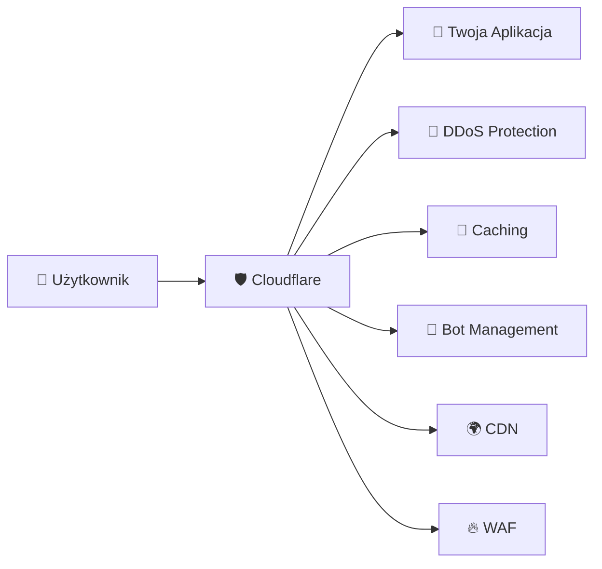

<!-- 
- DDoS Protection: Blokuje ataki typu Distributed Denial of Service
- Caching: Przechowuje kopie treści dla szybszego dostarczania
- Bot Management: Wykrywa i zarządza ruchem botów (automatycznym)
- CDN: Content Delivery Network - rozprowadza treści globalnie
- WAF: Web Application Firewall - chroni przed atakami webowymi
-->

---

# 📊 Skala Cloudflare

## **~16% całego ruchu internetowego** 🌍

> Każdy co szósty request w internecie przechodzi przez Cloudflare

### Znani użytkownicy:
| Kategoria | Firmy |
|-----------|-------|
| 🏢 Technologia | Mozilla, Microsoft Azure, Office 365, IBM |
| 🛒 E-commerce | Nike, H&M, Shopify |
| 💬 Social | Reddit, Digital Ocean |

---

# ⏰ Timeline awarii

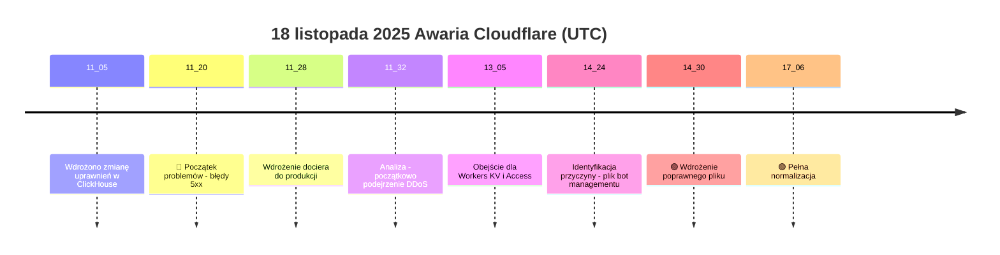

---

# 🤖 Bot Management - Źródło problemu

## Jak działa ocena botów?

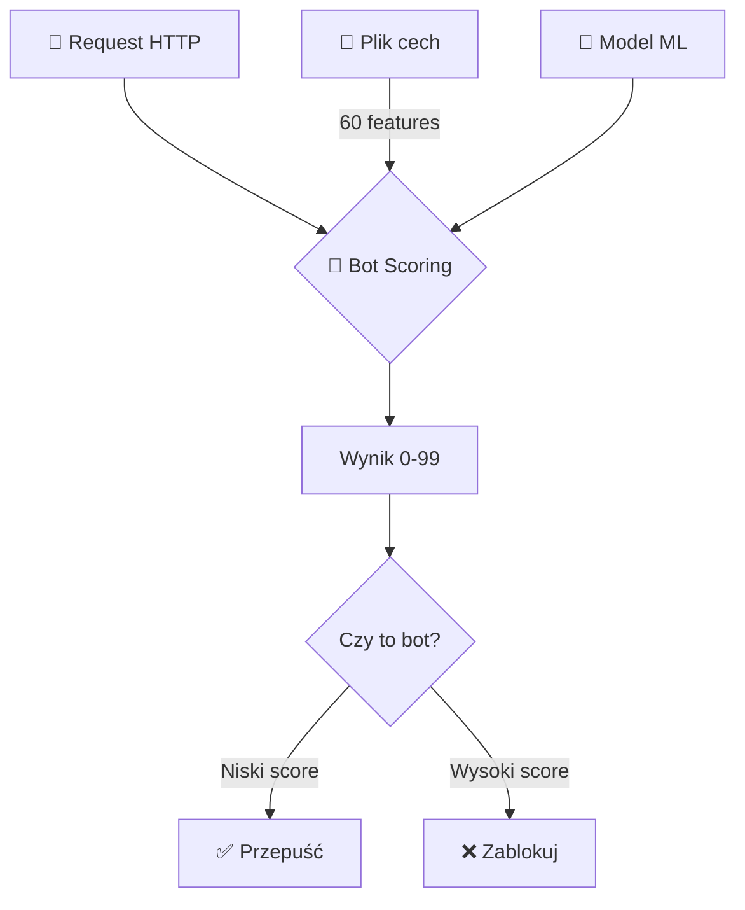

**Bot Score**: 0-99 (im wyżej = większe prawdopodobieństwo bota)

---

# 🗃️ Architektura ClickHouse

## Bazy danych i shardy

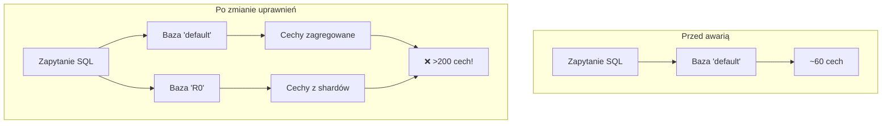

---

# 🔍 Zapytanie bez dyskryminatora bazy

```sql
SELECT
  name,
  type
FROM system.columns
WHERE
  table = 'http_requests_features'
ORDER BY name;
```

## ⚠️ Problem:
- Brak `WHERE database = 'default'`
- Po zmianie uprawnień → widoczne obie bazy
- **60 cech × 2 = 120+** cech

---

# 🦀 Rust i fatalne `unwrap()`

```rust
// Uproszczony kod który spowodował panikę
fn load_features(config: &Config) -> Features {
    let features = append_with_names(&config)
        .unwrap();  // 💥 BOOM!
    
    features
}
```

## Problem z prealokacją pamięci:
- **Limit:** 200 cech (bufor bezpieczeństwa)
- **Oczekiwane:** ~60 cech  
- **Otrzymane:** >200 cech (duplikaty)
- **Rezultat:** `Result::unwrap()` on `Err` → **PANIKA** 💀

---

# 💥 Mechanizm awarii

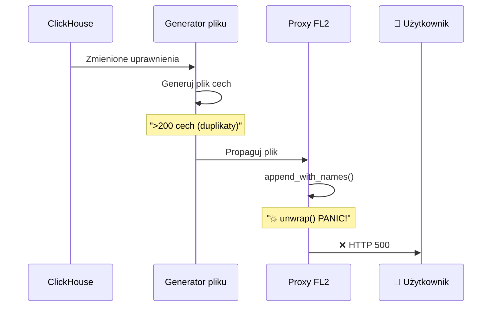

---

# 🎭 Czynniki mylące

## Dlaczego myśleli o ataku DDoS?

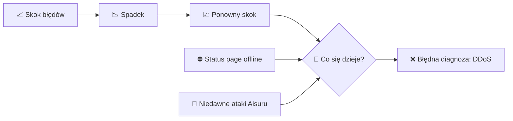

### Nietypowe zachowanie:
- Fluktuacje: stare nody miały poprawny cache
- Status page (niezależna infra) też offline → **zbieg okoliczności!**

---

# 📊 Wpływ na usługi

| Usługa | Wpływ |
|--------|-------|
| 🌐 **CDN / Bezpieczeństwo** | HTTP 5xx dla wszystkich klientów |
| 🔐 **Turnstile** | Całkowity brak działania |
| 📦 **Workers KV** | Podwyższony poziom błędów |
| 📊 **Dashboard** | Brak możliwości logowania |
| 🔑 **Access** | Błędy uwierzytelniania |
| 📧 **Email Security** | Obniżone wykrywanie spamu |

---

# 🔧 FL vs FL2 - Różny wpływ

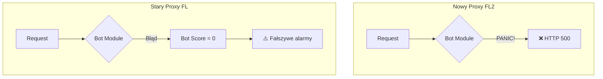

**FL2**: Twarde błędy 500  
**FL**: Wszystko = "nie-bot" → problemy z regułami blokowania

---

# 📝 Działania naprawcze Cloudflare

## Oficjalna lista:

1. 🔒 **Hardening** konfiguracji wewnętrznej (jak dane od użytkowników)
2. 🔘 **Kill-switches** - globalne wyłączniki funkcji
3. 💾 **Core dumps** - nie mogą przeciążać systemu
4. 🔍 **Przegląd trybów awarii** wszystkich modułów proxy

> *"Dzisiejsza awaria była najpoważniejszym incydentem od 2019 roku"*
> — Matthew Prince, CEO

---

# 💡 Nasze wnioski techniczne

## Co można było zrobić lepiej?

```rust
let features = append_with_names(&config).unwrap_or_default();
if features.len() > 200 {
    log::warn!("Pobrano {} cech, przekroczono limit 200. Biorę pierwsze 200.", features.len());
    features.truncate(200);
}
// ✅ Kontynuuj działanie z features
```

---

### Zamiast:
```rust
.unwrap()  // ❌ PANIC!
```

### Powinno być:
```rust
.unwrap_or_else(|e| { log::error!("{}", e); defaults() })
```

---

# 🏢 Problem organizacyjny

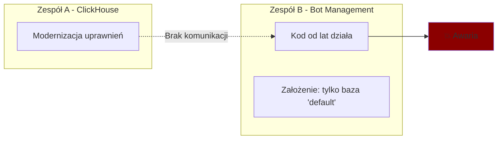

## 🎯 Kluczowy problem:
**Zmiana w jednym miejscu → eksplozja w innym**

---

# 🧪 A co ze środowiskiem testowym?

## Możliwe wyjaśnienie:

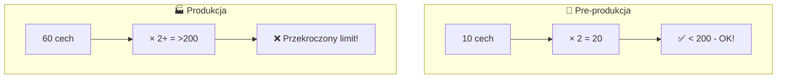

**Skala produkcji ≠ Skala testów**

---

<!-- style: h2 { font-size: 0.8em; } blockquote { font-size: 0.7em; } -->

# 🔥 Kluczowe lekcje

## 1️⃣ Defensywne programowanie

> Nigdy nie ufaj, że dane wejściowe będą poprawne

## 2️⃣ Graceful degradation

> System powinien działać ograniczenie, nie crashować

## 3️⃣ Komunikacja między zespołami

> Zmiany w jednym systemie mogą wpłynąć na inne

## 4️⃣ Testy na skali produkcyjnej

> Pre-prod musi odzwierciedlać rzeczywistość

---

# 📈 Wizualizacja awarii

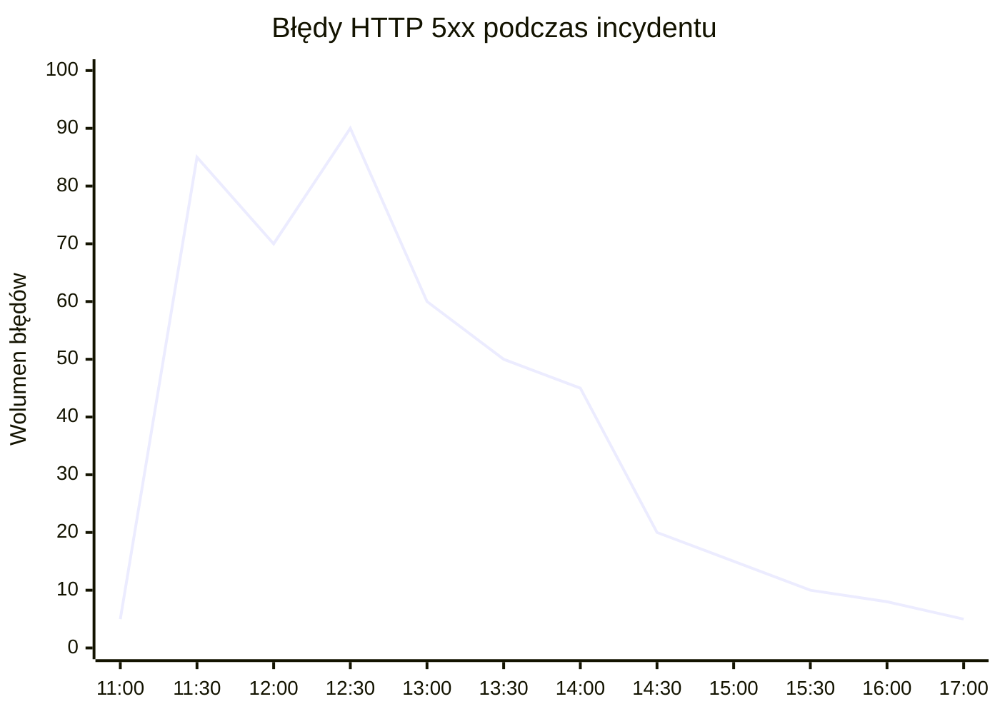

**Fluktuacje** = różne nody z różnymi wersjami pliku cech

---

# 🤔 Do dyskusji

## Pytania dla zespołu:

1. 🔍 **Czy mamy podobne "ukryte zależności"** w naszych systemach?

2. 🦀 **Jak obsługujemy błędy** w krytycznych ścieżkach kodu?

3. 📊 **Czy nasze środowiska testowe** odzwierciedlają skalę produkcji?

4. 🔔 **Jak szybko wykryjemy** awarię przed użytkownikami?

5. 📝 **Czy robimy post-mortemy** i czy są publiczne?

---

# 🎯 Podsumowanie

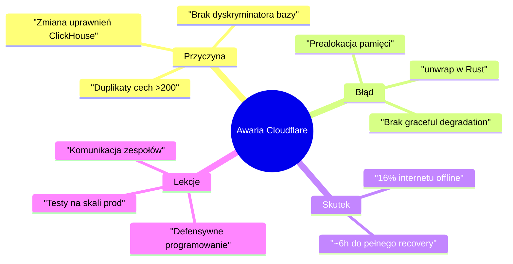

---

# 📚 Źródła

## Oficjalne Post-Mortem:
🔗 [blog.cloudflare.com/pl-pl/18-november-2025-outage](https://blog.cloudflare.com/pl-pl/18-november-2025-outage/)

## Video:
🎬 [IT News #25 - DevMentors](https://www.youtube.com/watch?v=ztxhKSBdtnM)

---

# 🙏 Dziękuję!

## Pytania?

```
   _____ _                 _ __ _                 
  / ____| |               | |/ _| |                
 | |    | | ___  _   _  __| | |_| | __ _ _ __ ___ 
 | |    | |/ _ \| | | |/ _` |  _| |/ _` | '__/ _ \
 | |____| | (_) | |_| | (_| | | | | (_| | | |  __/
  \_____|_|\___/ \__,_|\__,_|_| |_|\__,_|_|  \___|
                                                   
       🛡️ Post-Mortem 18.11.2025 🛡️
```

**Kontakt:** granica.lukasz@gmail.com
 

