# 🔥 Cloudflare Outage 2025
## How One File Took Down 16% of the Internet

**Geeks Club**

📅 December 10, 2025

---

# 📋 Agenda

1. 🌐 **Why is Cloudflare important?**
2. 💥 **What happened?** - Outage Timeline
3. 🔧 **Technical Analysis** - ClickHouse, Rust, unwrap()
4. 🎭 **Confusing Factors** - Why they thought it was a DDoS attack
5. 📝 **Conclusions and Remedial Actions**
6. 💭 **Comment** - What do we learn from this?

<!---
So like everyone else, I got hit by the CloudFlare outage at November 18th. After reading their post morten (which was honestly really detailed and transparent - mad respect for the team working hard to keep us all safe), I wanted to share some thoughts what can we learn from this mistake.
-->
---

# 🌐 What is Cloudflare?

**Middleware between the client and your application**

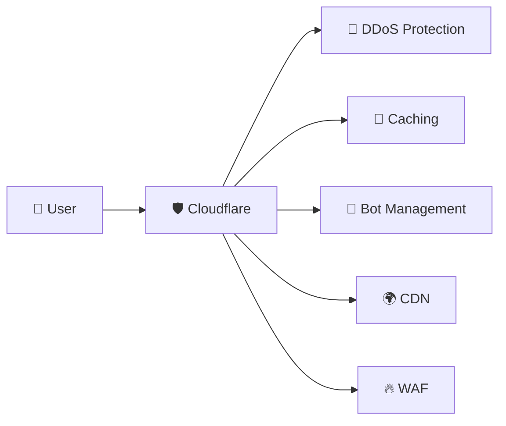

<!-- 
- DDoS Protection: Blokuje ataki typu Distributed Denial of Service
- Caching: Przechowuje kopie treści dla szybszego dostarczania
- Bot Management: Wykrywa i zarządza ruchem botów (automatycznym)
- CDN: Content Delivery Network - rozprowadza treści globalnie
- WAF: Web Application Firewall - chroni przed atakami webowymi
-->

---

# 📊 Cloudflare Scale

## **~16% of all internet traffic** 🌍

> Every sixth request on the internet goes through Cloudflare

### Known users:
| Category | Companies |
|----------|-----------|
| 🏢 Technology | Mozilla, Microsoft Azure, Office 365, IBM |
| 🛒 E-commerce | Nike, H&M, Shopify |
| 💬 Social | Reddit, Twitter |

<!--
Zapytaj jak ludzie doświadczyli awarii
-->
---

# 🤖 Bot Management - Source of the Problem

## How does bot scoring work?

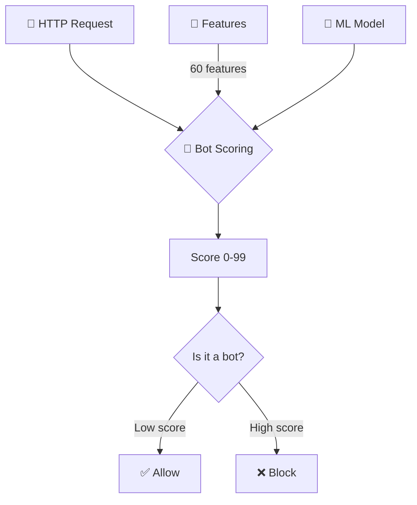

**Bot Score**: 0-99 (higher = greater bot probability)

<!--
Problem u Źródła: Funkcja Wykrywania Botów
Problem dotyczy feature'a związanego z wykrywaniem różnych botów, które wchodzą do infrastruktury przez Cloudflare. System analizuje ruch i decyduje, czy go przepuścić, czy zablokować.

Bot Scoring: W dużym uproszczeniu, jest to ocena od 0 do 99, która określa prawdopodobieństwo, czy request pochodzi od człowieka, czy od bota. Im wyższy wynik, tym większe prawdopodobieństwo, że to bot.
Technologia: Usługa ta opiera się na uczeniu maszynowym i analizuje zbiór cech (features) danego requestu.
Architektura i Konfiguracja
Lista cech nie jest sztywna. Jest na bieżąco aktualizowana na podstawie całego ruchu, który widzi Cloudflare, i propagowana na wszystkie instancje decydujące o przepuszczaniu ruchu.

Liczba cech: W momencie awarii było ich około 60.
Założony limit: Infrastruktura była przygotowana na maksymalnie 200 cech do analizy.
Proces: Zestaw cech jest pakowany do pliku, który jest generowany co 5 minut. Plik ten jest rozpropagowywany do modułu Bot Managementu, który na jego podstawie dokonuje asercji ML-owej.
-->

---

# 🗃️ ClickHouse Architecture

## Databases and shards

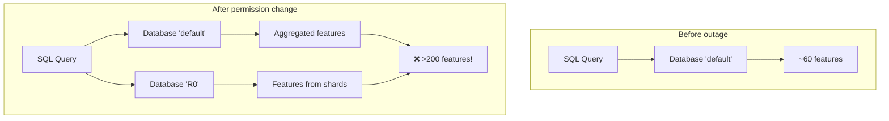

---

# 🔍 Query without database discriminator

```sql
SELECT
  name,
  type
FROM system.columns
WHERE
  table = 'http_requests_features'
ORDER BY name;
```

## ⚠️ Problem:
- No `WHERE database = 'default'`
- After permission change → both databases visible
- **60 features × 2 = 120+** features

---

# 🦀 Rust and fatal `unwrap()`

```rust
// Simplified code that caused panic
fn load_features(config: &Config) -> Features {
    let features = append_with_names(&config)
        .unwrap();  // 💥 BOOM!
    
    features
}
```

## Memory preallocation problem:
- **Limit:** 200 features (safety buffer)
- **Expected:** ~60 features  
- **Received:** >200 features (duplicates)
- **Result:** `Result::unwrap()` on `Err` → **PANIC** 💀

---

# ⏰ Outage Timeline

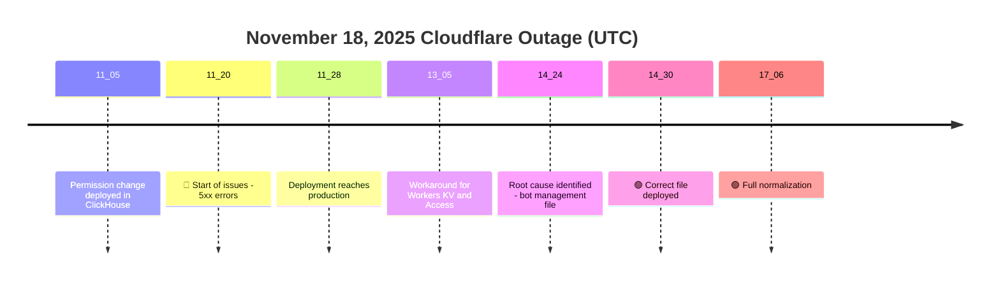

---

# 💥 Outage Mechanism

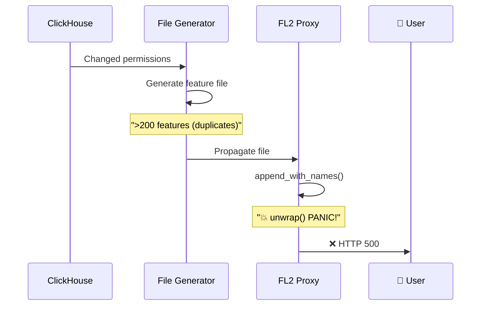

---

# 🎭 Confusing Factors

## Why did they think it was a DDoS attack?

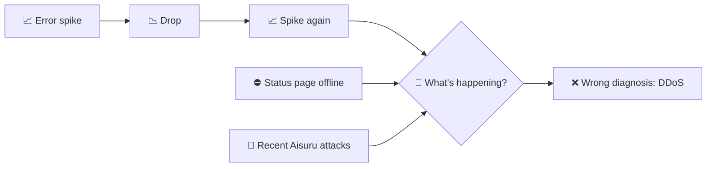

### Unusual behavior:
- Fluctuations: old nodes had correct cache
- Status page (independent infra) also offline → **coincidence!**

---

# 📊 Impact on Services

| Service | Impact |
|---------|--------|
| 🌐 **CDN / Security** | HTTP 5xx for all clients |
| 🔐 **Turnstile** | Complete failure |
| 📦 **Workers KV** | Increased error rate |
| 📊 **Dashboard** | Unable to log in |
| 🔑 **Access** | Authentication errors |
| 📧 **Email Security** | Reduced spam detection |

---

# 🔧 FL vs FL2 - Different Impact

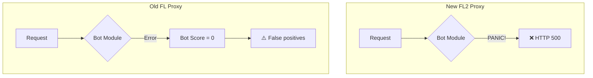

**FL2**: Hard 500 errors  
**FL**: Everything = "not-bot" → blocking rule issues

---

# 📝 Cloudflare Remedial Actions

## Official list:

1. 🔒 **Hardening** of internal configuration (like user data)
2. 🔘 **Kill-switches** - global function switches
3. 💾 **Core dumps** - cannot overload the system
4. 🔍 **Review failure modes** of all proxy modules

> *"Today's outage was the most serious incident since 2019"*
> — Matthew Prince, CEO

---

# 💡 Our Technical Conclusions

## What could have been done better?

```rust
let features = append_with_names(&config).unwrap_or_default();
if features.len() > 200 {
    log::warn!("Retrieved {} features, exceeded limit 200. Taking first 200.", features.len());
    features.truncate(200);
}
// ✅ Continue with features
```

<!-- 
Just take first 200 and let's continue 
-->

---

### Instead of:
```rust
.unwrap()  // ❌ PANIC!
```

### Should be:
```rust
.unwrap_or_else(|e| { log::error!("{}", e); defaults() })
```

<!--
The part that's interesting to me is there was no fallback. No "hey something's weird here, let me use the old config." Just straight up unwrap() and panic. In production. On critical infrastructure?
-->

---

## Preventing Deployment Spread: Circuit Breakers and Rollout Strategies

### Why did the update keep spreading?

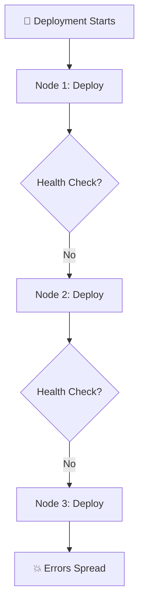

**Automated rollouts without real-time monitoring** → Errors propagate unchecked

---

### Circuit Breaker Pattern for Deployments

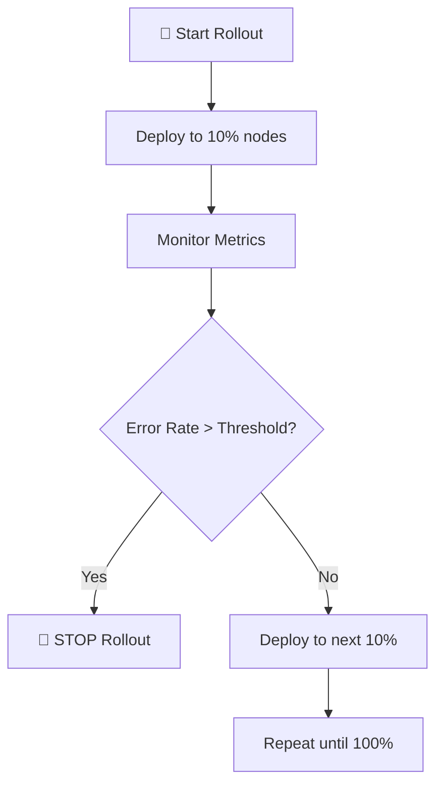

**Stop propagation if errors exceed safe limits**

---

### Different Strategies for Different Changes

| Change Type | Strategy | Speed vs Safety |
|-------------|----------|-----------------|
| 🔒 **Security Patches** | Fast rollout | ⚡ Speed (counter attacks) |
| 🏗️ **Infrastructure Changes** | Canary / Blue-Green | 🛡️ Safety (rollback ready) |

**Balance speed for security with caution for infra**

---

---

# 🏢 Organizational Problem

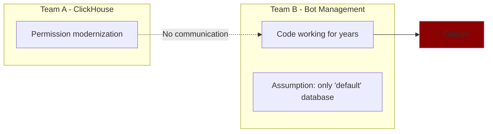

## 🎯 Key problem:
**Change in one place → explosion in another**

---

# 🧪 What about the test environment?

## Possible explanation:

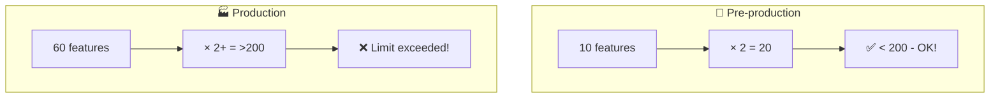

**Production scale ≠ Test scale**

---

<!-- style: h2 { font-size: 0.8em; } blockquote { font-size: 0.7em; } -->

# 🔥 Key Lessons

## 1️⃣ Defensive Programming

> Never trust that inputs will be correct

## 2️⃣ Graceful Degradation

> System should work limited, not crash

## 3️⃣ Inter-team Communication

> Changes in one system can affect others

## 4️⃣ Production-scale Testing

> Pre-prod must reflect reality

---

# 📈 Outage Visualization

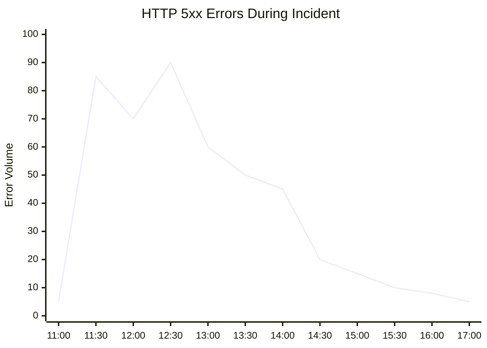

**Fluctuations** = different nodes with different feature file versions

---

# 🤔 For Discussion

## Questions for the team:

1. 🔍 **Do we have similar "hidden dependencies"** in our systems?

2. 🦀 **How do we handle errors** in critical code paths?

3. 📊 **Do our test environments** reflect production scale?

4. 🔔 **How quickly will we detect** an outage before users?

5. 📝 **Do we do post-mortems** and are they public?

---

# 🎯 Summary

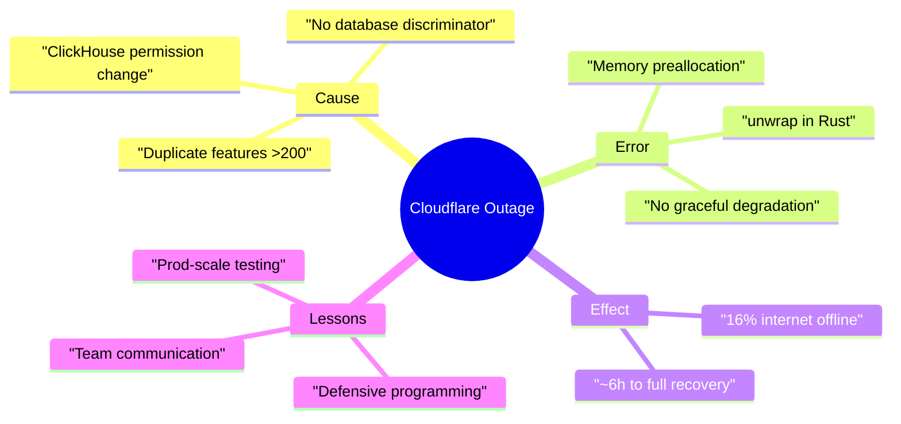

---

# 📚 Sources

## Official Post-Mortem:
🔗 [blog.cloudflare.com/18-november-2025-outage](https://blog.cloudflare.com/18-november-2025-outage/)

## Video:
🎬 [IT News #25 - DevMentors](https://www.youtube.com/watch?v=ztxhKSBdtnM)

---

# 🙏 Thank You!

## Questions?

```
   _____ _                 _ __ _                 
  / ____| |               | |/ _| |                
 | |    | | ___  _   _  __| | |_| | __ _ _ __ ___ 
 | |    | |/ _ \| | | |/ _` |  _| |/ _` | '__/ _ \
 | |____| | | (_) | |_| | (_| | | | | (_| | | |  __/
  \_____|_|\___/ \__,_|\__,_|_| |_|\__,_|_|  \___|
                                                   
       🛡️ Post-Mortem 18.11.2025 🛡️
```

**Contact:** granica.lukasz@gmail.com