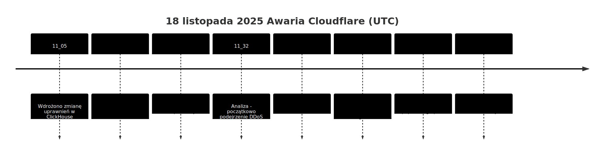
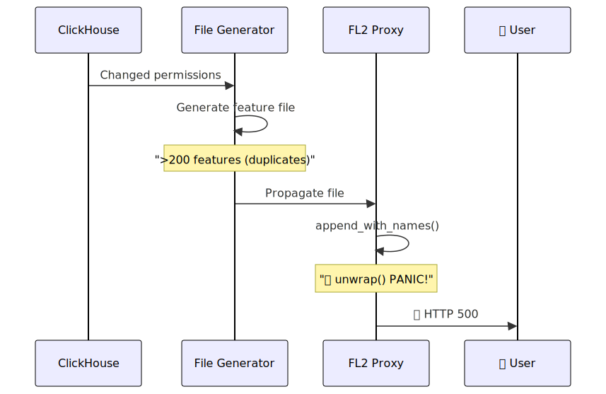

# 🔥 Cloudflare Outage 2025
## How One File Took Down 16% of the Internet

**Geeks Club1**

📅 December 10, 2025

---

# 📋 Agenda

1. 🌐 **Why is Cloudflare important?**
2. 💥 **What happened?** - Outage Timeline
3. 🔧 **Technical Analysis** - ClickHouse, Rust, unwrap()
4. 🎭 **Confusing Factors** - Why they thought it was a DDoS attack
5. 📝 **Conclusions and Remedial Actions**
6. 💭 **Comment** - What do we learn from this?

---

# 🌐 What is Cloudflare?

**Middleware between the client and your application**



---

# 📊 Cloudflare Scale

## **~16% of all internet traffic** 🌍

> Every sixth request on the internet goes through Cloudflare

### Known users:
| Category | Companies |
|----------|-----------|
| 🏢 Technology | Mozilla, Microsoft Azure, Office 365, IBM |
| 🛒 E-commerce | Nike, H&M, Shopify |
| 💬 Social | Reddit, Digital Ocean |

---

# ⏰ Outage Timeline



---

# 🤖 Bot Management - Source of the Problem

## How does bot scoring work?



**Bot Score**: 0-99 (higher = greater bot probability)

---

# 🗃️ ClickHouse Architecture

## Databases and shards



---

# 🔍 Query without database discriminator

```sql
SELECT
  name,
  type
FROM system.columns
WHERE
  table = 'http_requests_features'
ORDER BY name;
```

## ⚠️ Problem:
- No `WHERE database = 'default'`
- After permission change → both databases visible
- **60 features × 2 = 120+** features

---

# 🦀 Rust and fatal `unwrap()`

```rust
// Simplified code that caused panic
fn load_features(config: &Config) -> Features {
    let features = append_with_names(&config)
        .unwrap();  // 💥 BOOM!
    
    features
}
```

## Memory preallocation problem:
- **Limit:** 200 features (safety buffer)
- **Expected:** ~60 features  
- **Received:** >200 features (duplicates)
- **Result:** `Result::unwrap()` on `Err` → **PANIC** 💀

---

# 💥 Outage Mechanism



---

# 🎭 Confusing Factors

## Why did they think it was a DDoS attack?



### Unusual behavior:
- Fluctuations: old nodes had correct cache
- Status page (independent infra) also offline → **coincidence!**

---

# 📊 Impact on Services

| Service | Impact |
|---------|--------|
| 🌐 **CDN / Security** | HTTP 5xx for all clients |
| 🔐 **Turnstile** | Complete failure |
| 📦 **Workers KV** | Increased error rate |
| 📊 **Dashboard** | Unable to log in |
| 🔑 **Access** | Authentication errors |
| 📧 **Email Security** | Reduced spam detection |

---

# 🔧 FL vs FL2 - Different Impact



**FL2**: Hard 500 errors  
**FL**: Everything = "not-bot" → blocking rule issues

---

# 📝 Cloudflare Remedial Actions

## Official list:

1. 🔒 **Hardening** of internal configuration (like user data)
2. 🔘 **Kill-switches** - global function switches
3. 💾 **Core dumps** - cannot overload the system
4. 🔍 **Review failure modes** of all proxy modules

> *"Today's outage was the most serious incident since 2019"*
> — Matthew Prince, CEO

---

# 💡 Our Technical Conclusions

## What could have been done better?

```rust
let features = append_with_names(&config).unwrap_or_default();
if features.len() > 200 {
    log::warn!("Retrieved {} features, exceeded limit 200. Taking first 200.", features.len());
    features.truncate(200);
}
// ✅ Continue with features
```

---

### Instead of:
```rust
.unwrap()  // ❌ PANIC!
```

### Should be:
```rust
.unwrap_or_else(|e| { log::error!("{}", e); defaults() })
```

---

# 🏢 Organizational Problem



## 🎯 Key problem:
**Change in one place → explosion in another**

---

# 🧪 What about the test environment?

## Possible explanation:



**Production scale ≠ Test scale**

---

<!-- style: h2 { font-size: 0.8em; } blockquote { font-size: 0.7em; } -->

# 🔥 Key Lessons

## 1️⃣ Defensive Programming

> Never trust that inputs will be correct

## 2️⃣ Graceful Degradation

> System should work limited, not crash

## 3️⃣ Inter-team Communication

> Changes in one system can affect others

## 4️⃣ Production-scale Testing

> Pre-prod must reflect reality

---

# 📈 Outage Visualization



**Fluctuations** = different nodes with different feature file versions

---

# 🤔 For Discussion

## Questions for the team:

1. 🔍 **Do we have similar "hidden dependencies"** in our systems?

2. 🦀 **How do we handle errors** in critical code paths?

3. 📊 **Do our test environments** reflect production scale?

4. 🔔 **How quickly will we detect** an outage before users?

5. 📝 **Do we do post-mortems** and are they public?

---

# 🎯 Summary


---

# 📚 Sources

## Official Post-Mortem:
🔗 [blog.cloudflare.com/18-november-2025-outage](https://blog.cloudflare.com/18-november-2025-outage/)

## Video:
🎬 [IT News #25 - DevMentors](https://www.youtube.com/watch?v=ztxhKSBdtnM)

---

# 🙏 Thank You!

## Questions?

```
   _____ _                 _ __ _                 
  / ____| |               | |/ _| |                
 | |    | | ___  _   _  __| | |_| | __ _ _ __ ___ 
 | |    | |/ _ \| | | |/ _` |  _| |/ _` | '__/ _ \
 | |____| | | (_) | |_| | (_| | | | | (_| | | |  __/
  \_____|_|\___/ \__,_|\__,_|_| |_|\__,_|_|  \___|
                                                   
       🛡️ Post-Mortem 18.11.2025 🛡️
```

**Contact:** granica.lukasz@gmail.com