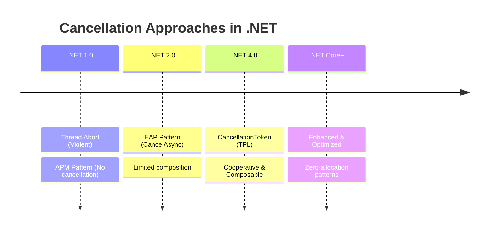
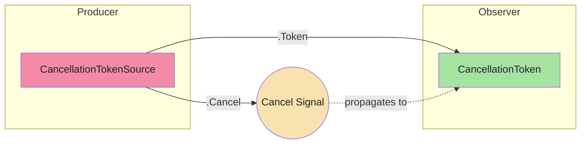
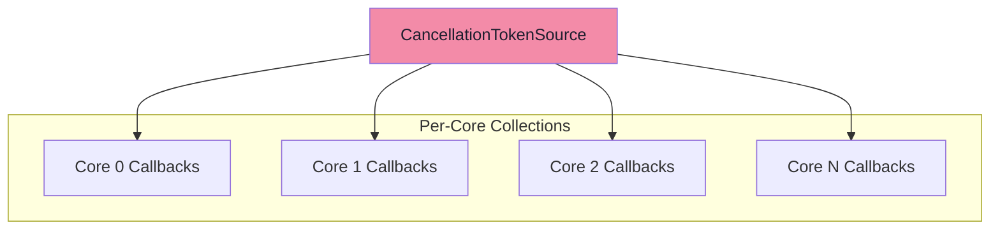

<!-- _class: lead -->
# ⏱️ Cancellation Tokens in .NET
## Deep Dive with Stephen Toub's Insights

🖥️ Tech Meeting Presentation

---

# 📋 Agenda

1. **Why Cancellation Matters** - Performance & Resource Management
2. **Evolution of Cancellation** - From `Thread.Abort` to `CancellationToken`
3. **The Modern Model** - Cooperative Cancellation
4. **Producer/Consumer Pattern** - `CancellationTokenSource` vs `CancellationToken`
5. **Implementation Deep Dive** - How it works under the hood
6. **The `volatile` Keyword** - Memory visibility
7. **Performance Evolution** - .NET Framework vs Modern .NET

---

# ❓ Why Cancellation?

> "Some of the best optimizations possible are the ones where you just avoid work that you don't have to do."
> — Stephen Toub

### Key Benefits:
- ⚡ **Performance** - Avoid unnecessary work
- 💾 **Resource Management** - Free up resources for other tasks
- 👥 **User Experience** - Responsive applications

---

# ☠️ The Bad Old Days: Thread.Abort

```csharp
// DON'T DO THIS - "Violent" cancellation
thread.Abort(); // ☠️ Extremely dangerous!
```

### Problems:
- 💣 Could abort at ANY point in execution
- 🗄️ Data corruption risk
- 🔒 Lock state corruption
- 🚫 Removed in .NET Core (with exceptions)

---

# 📅 Evolution of Cancellation in .NET



---

# 🔗 APM Pattern - No Cancellation

```csharp
// Asynchronous Programming Model (Begin/End)
stream.BeginRead(buffer, 0, buffer.Length, callback, state);

// ❌ No way to cancel!
// ❌ IAsyncResult has nothing about cancellation
// ❌ Thread.Abort doesn't help - there might not even be a thread!
```

### The Problem:
> "You might just have some little pending piece of work in memory waiting for a message to come back over a socket. There's nothing to 'shoot.'"

---

# 📆 EAP Pattern - Limited Solution

```csharp
// Event-based Asynchronous Pattern
var worker = new BackgroundWorker();
worker.DoWork += (s, e) => { /* work */ };
worker.RunWorkerAsync();

// Can cancel...
worker.CancelAsync();
```

### ⚠️ But Still Limited:
- Callback receives a boolean flag
- **No composition** - Can't flow cancellation to child operations
- Very short-lived pattern (.NET Framework 2.0 only)

---

<!-- _class: lead -->
# 🤝 The Modern Solution
## Cooperative Cancellation with `CancellationToken`

---

# 🧩 CancellationToken - Composability

```csharp
public async Task ProcessAsync(CancellationToken token)
{
    await DoWorkAsync(token);      // ✅ Pass it down
    await MoreWorkAsync(token);    // ✅ Everyone can observe
    await FinalWorkAsync(token);   // ✅ Entire chain is cancellable
}
```

### Key Design Principles:
- 🔗 **Composable** - Thread it through all calls
- 👁️ **Observable** - Poll or register for callbacks
- 🤝 **Cooperative** - Not violent, everyone opts in

---

# 💻 Modern API Convention

```csharp
// 99.999% of async APIs accept CancellationToken
await stream.ReadAsync(buffer, cancellationToken);
await httpClient.GetAsync(url, cancellationToken);
await dbContext.SaveChangesAsync(cancellationToken);
```

### Static Analyzers Help:
- ⚠️ Warnings if you accept a token but don't forward it
- 🛡️ Enforces best practices

---

# 🚫 Why NOT Ambient/Implicit Cancellation?

Microsoft tried `CancellationScope` twice - **both times abandoned**

```csharp
// ❌ This was considered and rejected
using (CancellationScope.Create())
{
    // Everything here would be "magically" cancellable
    await DoWorkAsync(); // No token needed?
}
```

---

# 🔥 Dangers of Ambient Cancellation

| Problem | Description |
|---------|-------------|
| 🎲 **Dangerous Timing** | Cancellation at ANY point = back to "violent" |
| 🔀 **Lack of Control** | Can't combine with timeouts easily |
| 🗑️ **Resource Leaks** | Task to release resource might get cancelled |
| 🔍 **Hard to Analyze** | Can't tell if you're in cancellable region |

> "With the explicit model, it's in your face."

---

# ↔️ Propagating vs Checking

```csharp
public async Task CopyAsync(Stream src, Stream dst, 
                            CancellationToken ct)
{
    byte[] buffer = new byte[81920];
    int bytesRead;
    
    // Just PROPAGATE the token - don't check it yourself
    while ((bytesRead = await src.ReadAsync(buffer, ct)) > 0)
    {
        await dst.WriteAsync(buffer, 0, bytesRead, ct);
    }
}
```

### 💡 Most code just forwards the token
The **leaf operations** (`ReadAsync`, `WriteAsync`) do the actual checking

---

<!-- _class: lead -->
# ✂️ Producer/Consumer Pattern
## `CancellationTokenSource` vs `CancellationToken`

---

# 🛡️ Separation of Concerns



---

# 💻 The Pattern in Action

```csharp
// PRODUCER - Controls cancellation
var cts = new CancellationTokenSource();

// Start work with the token
_ = ProcessAsync(cts.Token);

// Later... request cancellation
cts.Cancel();

// CONSUMER - Only observes
async Task ProcessAsync(CancellationToken token)
{
    // ✅ Can check: token.IsCancellationRequested
    // ✅ Can throw: token.ThrowIfCancellationRequested()
    // ❌ Cannot cancel for others
}
```

---

# ❓ Why the Separation?

> "It would be super surprising if one of [the methods receiving a token] actually caused cancellation to occur for everyone else."

### Who Produces?
- 🖥️ Server shutting down
- 👤 User clicking "Cancel"
- ⏰ Timeout timer firing
- 🔌 Connection closing

### Who Consumes?
- 💻 Everything else! (99.999% of code)

---

# 🔧 Simplified Implementation

```csharp
public readonly struct MyCancellationToken
{
    private readonly MyCancellationTokenSource _source;
    
    public bool IsCancellationRequested => 
        _source?.IsCancellationRequested ?? false;
}

public class MyCancellationTokenSource
{
    private volatile bool _isCancellationRequested;
    
    public MyCancellationToken Token => new(this);
    
    public void Cancel() => _isCancellationRequested = true;
}
```

---

<!-- _class: lead -->
# 🔬 The `volatile` Keyword
## Memory Visibility in Multi-threaded Code

---

# 🐛 The Problem Without `volatile`

```csharp
bool requested = false;

// Worker thread polling
while (!requested)  
{
    // do work
}
```

### ✨ JIT Compiler "Optimization":
```csharp
// Compiler can transform to:
if (!requested)
{
    while (true) { } // ♾️ INFINITE LOOP!
}
```

---

# 🙈 Why Does This Happen?

The JIT compiler can:
- 🗜️ **Coalesce reads** - "I already read it, why read again?"
- ⬆️ **Hoist checks** - Move invariant checks outside loops

```csharp
// These three reads...
var r1 = someField;
var r2 = someField;
var r3 = someField;

// Can become just one!
var r1 = someField;
var r2 = r1;
var r3 = r1;
```

---

# 🛡️ `volatile` to the Rescue

```csharp
private volatile bool _isCancellationRequested;
```

### What `volatile` Does:
- 🚫 **Prevents read elimination** - Every read must happen
- 👁️ **Visibility guarantee** - All threads see updates
- 🔄 **Memory barrier** - Prevents reordering

### What `volatile` Does NOT Do:
- 🔒 Does NOT replace locks
- 🔁 Does NOT synchronize operations
- 🛡️ Does NOT prevent race conditions

---

# ⚠️ When to Use `volatile`

> "It is used if you are doing **lock-free programming**, which very few people should actually be doing."
> — Stephen Toub

### ✅ Use if:
- Writing low-level, lock-free framework code
- Super high-performance scenarios
- You really know what you're doing

### ❌ Don't use if:
- Building normal applications
- "Text boxes over data" work
- You're not sure why you need it

---

# 💬 Stephen's Advice

> "If you see [volatile] too much, it means something's wrong."

> "I have a 200-something page blog post on performance improvements in .NET 10, and I don't know if `volatile` shows up there at all."

---

<!-- _class: lead -->
# 📈 Performance Evolution
## .NET Framework vs Modern .NET

---

# 🧪 The Benchmark

```csharp
var cts = new CancellationTokenSource();

Parallel.For(0, 1_000_000, i =>
{
    using (cts.Token.Register(() => { }))
    {
        // Register and immediately unregister
    }
});
```

---

# 🔄 Surprising Results

| Metric | .NET Framework | .NET 10 |
|--------|---------------|---------|
| **Speed** | ~25-30 ns/op 🏆 | ~50-60 ns/op |
| **Memory** | 56 bytes/op | **0 bytes** 🏆 |

### 💡 Wait... Framework is FASTER?

---

# 📜 What Were They Optimizing For?

### .NET Framework Era (~2010):
- 🔬 "Many-core" future (32, 64, 1024 cores!)
- 🗺️ Parallel algorithms (Quicksort, PLINQ)
- 👥 Thousands of parallel registrations

```csharp
// Imagined scenario: Parallel Quicksort
// Many cores registering/unregistering simultaneously
Parallel.ForEach(partitions, partition => 
{
    QuickSort(partition, cancellationToken);
});
```

---

# 🏗️ .NET Framework Implementation



- 🔓 Lock-free algorithms
- 📚 Per-core data structures
- 🔄 No synchronization between cores

---

# 🖥️ Modern Reality

### How CancellationToken is Actually Used:
```csharp
// ASP.NET Request - Sequential, not parallel!
app.MapGet("/api/data", async (CancellationToken ct) =>
{
    var data = await db.QueryAsync(ct);     // 1️⃣
    var result = await Transform(data, ct); // 2️⃣
    await cache.SetAsync(result, ct);       // 3️⃣
    return result;
});
```

➡️ Sequential register/unregister, not parallel

---

# ⚖️ The Trade-off

| Aspect | .NET Framework | Modern .NET |
|--------|---------------|-------------|
| **Algorithm** | Complex, lock-free | Simple, uses locks |
| **Parallel Perf** | 🏆 Faster | Slower |
| **Serial Perf** | Slower | 🏆 Faster |
| **Memory** | Allocates per op | 🏆 Zero allocation (pooling) |
| **Maintainability** | Complex | Simple |

---

# 🧠 Philosophy of Optimization

> "The vast majority of optimizations are **trade-offs**. They're penalizing something you expect to be relatively rare in exchange for making something you expect to be more common faster."
> — Stephen Toub

### 👓 With 20/20 Hindsight:
- Parallel register/unregister is rare
- Serial async I/O is the dominant pattern
- Zero allocation > raw speed for most scenarios

---

<!-- _class: lead -->
# 🎓 Key Takeaways

---

# 📋 Summary

1. 🤝 **Cooperative cancellation** is the .NET way - not violent
2. 🧩 **CancellationToken** enables composition across async boundaries
3. 🛡️ **Separation of concerns**: Source produces, Token observes
4. ➡️ **Just propagate** the token - let leaf operations check it
5. ❗ **Explicit > Implicit** - Ambient cancellation was tried and rejected
6. 🔬 **`volatile`** is for visibility, not synchronization
7. 📈 **Optimizations are trade-offs** - Modern .NET optimizes for real-world patterns

---

# 📚 Resources

- 🎬 [Deep.net - Cancellation Tokens with Stephen Toub](https://www.youtube.com/watch?v=h1GvSPaRQ-U)
- 📝 Stephen Toub's Performance Blog Posts
- 📖 [Microsoft Docs: Cancellation in Managed Threads](https://docs.microsoft.com/en-us/dotnet/standard/threading/cancellation-in-managed-threads)

---

<!-- _class: lead -->
# 💬 Questions?

<br>

### Thank you! ❤️
