<style>
  table, table th, table td { color: #000000 !important; }
</style>

<!-- _paginate: false -->
<!-- _class: lead -->

# 🧠 Agent Skills
## Turn General-Purpose AI into Domain Specialists

**Geeks Club**

📅 February 2026

<!--
Welcome everyone to Geeks Club!
Today we'll talk about Agent Skills — a powerful mechanism for extending AI agent capabilities.
Whether you use Claude Code, the Claude API, or VS Code Copilot — Skills are becoming fundamental.
-->

---

# 📋 Agenda

1. 🤔 **What are Skills?** — Definition & mental model
2. 🎯 **Why use Skills?** — Benefits & use cases
3. ⚙️ **How Skills work** — Progressive disclosure & architecture
4. 🏗️ **Skill structure** — Anatomy of a SKILL.md
5. 📐 **Core principles** — Conciseness, degrees of freedom
6. ✍️ **Creating a Skill** — Step-by-step guide
7. 📦 **Patterns & examples** — Real-world Skills
8. 🚫 **Anti-patterns** — What to avoid
9. 💭 **Discussion**

<!--
We'll cover everything from the fundamentals to hands-on examples.
By the end, you'll be ready to create your own Skills.
-->

---

# 🤔 What are Skills?

> Reusable, filesystem-based resources that provide AI agents with **domain-specific expertise**: workflows, context, and best practices.

### Key idea:

Skills transform **general-purpose agents** into **specialists**.

| Concept | Analogy |
|---------|---------|
| 🧠 Skill | An onboarding guide for a new team member |
| 📝 Prompt | A one-off sticky note with instructions |
| 🔧 Tool | A specific capability (e.g., run code, search) |

Skills differ from prompts — they **load on-demand** and eliminate the need to repeatedly provide the same guidance.

<!--
Think of Skills as the difference between telling someone the same thing every day vs giving them a reference manual.
A Skill is like a comprehensive onboarding document — once created, it's automatically used whenever relevant.
Unlike prompts which are conversation-level, Skills persist and are reusable.
-->

---

# 🎯 Why Use Skills?

### Three key benefits:

- 🎓 **Specialize the agent** — Tailor capabilities for domain-specific tasks
- 🔄 **Reduce repetition** — Create once, use automatically across conversations
- 🧩 **Compose capabilities** — Combine Skills to build complex workflows

### Without Skills:
```
You: "Remember to always filter test accounts, use UTC timestamps,
     and follow our naming convention for BigQuery tables..."
     (... every single conversation)
```

### With Skills:
```
You: "Analyze Q4 revenue"
Agent: (automatically loads BigQuery Skill with all your conventions)
```

<!--
Skills solve the "repeating yourself" problem.
Instead of providing context every time, encode it once and let the agent load it when needed.
This is especially valuable for team-wide conventions and domain knowledge.
-->

---

# ⚙️ How Skills Work — Progressive Disclosure

Skills leverage a **three-level loading** strategy:



Only relevant content occupies the **context window** at any given time.

<!--
This is the key architecture insight.
Level 1 — just the name and description — is always loaded. Like reading a table of contents.
Level 2 — the actual SKILL.md body — only loads when the task matches. That's ~5k tokens typically.
Level 3 — additional reference files, scripts — only load when explicitly needed.
This means you can install many Skills without context penalty.
-->

---

# 📊 Three Levels in Detail

| Level | When loaded | Token cost | Content |
|-------|------------|------------|---------|
| **Level 1** — Metadata | Always (startup) | ~100 tokens/Skill | `name` and `description` from YAML |
| **Level 2** — Instructions | When triggered | < 5k tokens | SKILL.md body |
| **Level 3** — Resources | As needed | Effectively unlimited | Bundled files, scripts, schemas |

### Example flow:

```
User: "Extract text from this PDF"
                  ↓
Agent checks metadata: "pdf-processing" matches! → reads SKILL.md
                  ↓
SKILL.md says: "For forms, see FORMS.md" → user didn't ask about forms → skip
                  ↓
Agent uses instructions from SKILL.md to complete the task
```

<!--
The key insight here is that Level 3 content has zero context cost until accessed.
You can bundle megabytes of reference material, and if it's not needed, it doesn't consume any tokens.
This is because Skills run in a VM with filesystem access — Claude reads files via bash.
Scripts are executed — their code never enters context, only the output.
-->

---

# 🏗️ Skill Structure — Anatomy of SKILL.md

Every Skill requires a `SKILL.md` file with **YAML frontmatter**:

```markdown
---
name: pdf-processing
description: Extract text and tables from PDF files, fill forms,
  merge documents. Use when working with PDF files or when the user
  mentions PDFs, forms, or document extraction.
---

# PDF Processing

## Quick start

Use pdfplumber to extract text from PDFs:

⁣```python
import pdfplumber
with pdfplumber.open("document.pdf") as pdf:
    text = pdf.pages[0].extract_text()
⁣```

## Advanced features
**Form filling**: See [FORMS.md](FORMS.md) for complete guide
**API reference**: See [REFERENCE.md](REFERENCE.md) for all methods
```

<!--
The frontmatter is critical — name and description are how the agent discovers Skills.
The description should include BOTH what the Skill does AND when to use it.
The body contains procedural knowledge — workflows, best practices, and guidance.
Reference files are linked but only loaded when needed.
-->

---

# 📁 Directory Structure

A Skill can be simple or complex:



### Rule: **Keep references one level deep** from SKILL.md.

<!--
Start simple — many effective Skills are just a single SKILL.md file.
As your Skill grows, split into separate files for progressive disclosure.
But NEVER create deeply nested references — Claude may partially read them.
All reference files should link directly from SKILL.md.
-->

---

# 📐 Core Principle 1: Conciseness

> The **context window** is a public good. Your Skill shares it with everything else.

### Default assumption: **The agent is already very smart.**

Only add context the agent doesn't already have. Challenge each piece:

| ❌ Too verbose (~150 tokens) | ✅ Concise (~50 tokens) |
|------------------------------|------------------------|
| "PDF files are a common format that contains text, images, and other content. To extract text, you'll need a library. There are many libraries available..." | "Use pdfplumber for text extraction:" + code |

### Ask yourself:
- 🤔 "Does the agent really **need** this explanation?"
- 🤔 "Can I **assume** the agent knows this?"
- 🤔 "Does this paragraph justify its **token cost**?"

<!--
This is the #1 mistake people make — over-explaining things the agent already knows.
Claude knows what a PDF is. It knows how to install packages. It knows Python.
Focus on YOUR specific conventions, rules, and domain knowledge that the agent can't infer.
Keep SKILL.md body under 500 lines for optimal performance.
-->

---

# 📐 Core Principle 2: Degrees of Freedom

Match **specificity** to the task's fragility:

### 🟢 High freedom — Multiple valid approaches
```markdown
## Code review process
1. Analyze the code structure and organization
2. Check for potential bugs or edge cases
3. Suggest improvements for readability
```

### 🟡 Medium freedom — Preferred pattern with variation
```markdown
## Generate report
Use this template and customize as needed:
def generate_report(data, format="markdown", include_charts=True):
    # Process data, generate output, optionally add visualizations
```

### 🔴 Low freedom — Fragile, must be exact
```markdown
## Database migration
Run exactly this script:
python scripts/migrate.py --verify --backup
Do not modify the command or add additional flags.
```

<!--
Think of the agent as a robot exploring a path.
Narrow bridge with cliffs — give exact instructions, low freedom.
Open field with no hazards — give general direction, high freedom.
Database migrations need exact scripts. Code reviews benefit from flexibility.
Match your instruction specificity to how fragile the operation is.
-->

---

# 🌍 Where Skills Work


### ⚠️ Skills do NOT sync across surfaces
Upload/configure separately for each platform.

<!--
Skills are available across Claude's ecosystem but each has different capabilities.
Claude.ai and API support pre-built Skills for PowerPoint, Excel, Word, PDF.
Claude Code and Agent SDK support only custom Skills.
VS Code Copilot uses filesystem-based Skills in .github/skills/ directories.
Important caveat: Skills don't sync between platforms — you need to set them up in each.
-->

---

# ✍️ Creating a Skill — Step by Step


### Step 1: Complete a task with normal prompting first
Notice what context you repeatedly provide.

### Step 2: Identify the reusable pattern
Table schemas, naming conventions, filtering rules, query patterns.

### Step 3: Write SKILL.md
Package the knowledge you had to provide manually.

<!--
The most effective development process involves the agent itself!
Work through a problem first, then extract the reusable pattern.
Don't start by trying to imagine what the Skill needs — start by doing the work.
This way you capture actual requirements, not imagined ones.
-->

---

# ✍️ Naming & Description Best Practices

### Name format: **gerund form** (verb + -ing)

| ✅ Good names | ❌ Bad names |
|--------------|-------------|
| `processing-pdfs` | `helper` |
| `analyzing-spreadsheets` | `utils` |
| `managing-databases` | `documents` |
| `writing-documentation` | `claude-tools` |

### Description: **what + when** in third person

```yaml
# ✅ Good
description: "Analyze Excel spreadsheets, create pivot tables,
  generate charts. Use when analyzing Excel files, spreadsheets,
  tabular data, or .xlsx files."

# ❌ Bad
description: "Helps with documents"
description: "I can help you process Excel files"
```

<!--
The name must be lowercase letters, numbers, and hyphens only. Max 64 characters.
Always use gerund form for consistency.
The description is CRITICAL — it's how the agent discovers which Skill to load.
Write in third person. Be specific. Include trigger keywords.
Think of description as the "search index" — if your keywords don't match the task, the Skill won't activate.
-->

---

# 📦 Pattern: Progressive Disclosure

### Pattern 1 — High-level guide with references:
```
SKILL.md     → Quick start + links to details
FORMS.md     → Form-filling guide (loaded as needed)
REFERENCE.md → API reference (loaded as needed)
```

### Pattern 2 — Domain-specific organization:
```
bigquery-skill/
├── SKILL.md (overview and navigation)
└── reference/
    ├── finance.md   (revenue, billing metrics)
    ├── sales.md     (opportunities, pipeline)
    └── product.md   (API usage, features)
```

### Pattern 3 — Conditional details:
```
SKILL.md     → Basic instructions
REDLINING.md → Only when tracked changes needed
OOXML.md     → Only when deep XML editing needed
```

<!--
Progressive disclosure is the core design pattern for Skills.
Pattern 1 is good for Skills with a clear quick start but detailed features.
Pattern 2 is perfect when different tasks need different domain knowledge.
Pattern 3 works when most requests are simple but some need advanced features.
In all cases — only what's needed enters the context window.
-->

---

# 🔄 Workflows & Feedback Loops

### Use workflows for complex tasks:

```markdown
## PDF form filling workflow

Task Progress:
- [ ] Step 1: Analyze the form (run analyze_form.py)
- [ ] Step 2: Create field mapping (edit fields.json)
- [ ] Step 3: Validate mapping (run validate_fields.py)
- [ ] Step 4: Fill the form (run fill_form.py)
- [ ] Step 5: Verify output (run verify_output.py)
```

### Implement feedback loops:



Validation loops **greatly improve** output quality.

<!--
For complex multi-step tasks, provide clear checklists.
The agent can copy the checklist and track progress.
Always include validation steps — don't let the agent skip from "edit" to "done".
The feedback loop pattern: run validator, fix errors, repeat.
This catches errors early and prevents cascading failures.
-->

---

# 🛠️ Example: Our Presentation Skill

We use a Skill right here in this repo!

```
.github/skills/creating-geeks-club-marp-presentation/
└── SKILL.md
```

```yaml
name: creating-geeks-club-marp-presentation
description: Creates Marp slide deck presentations for Geeks Club — 
  a developer-to-developer knowledge sharing meeting. Use when the 
  user asks to create, scaffold, or generate a new presentation, 
  slide deck, or talk for Geeks Club.
```

### What it encodes:
- 🎨 **Visual identity** — dark theme, color palette, CSS
- 📁 **Folder structure** — numbered folders, naming conventions
- 📊 **Diagram standards** — Mermaid syntax, max 8 nodes
- 📝 **Slide patterns** — recommended flow, presenter notes
- 🔧 **Build process** — CI pipeline, local development

<!--
Meta moment — this presentation was created BY a Skill, ABOUT Skills!
The Skill encodes everything about how Geeks Club presentations should look and feel.
Without it, I'd have to explain the theme colors, folder structure, and conventions every time.
With it, I just say "create a presentation about X" and all conventions are applied automatically.
This is the power of Skills — domain knowledge that persists across conversations.
-->

---

# 🛠️ Example: BigQuery Analytics Skill

```
bigquery-skill/
├── SKILL.md
└── reference/
    ├── finance.md    (revenue metrics, ARR, billing)
    ├── sales.md      (opportunities, pipeline, accounts)
    ├── product.md    (API usage, features, adoption)
    └── marketing.md  (campaigns, attribution, email)
```

### What SKILL.md contains:

```markdown
## Rules
- ALWAYS filter out test accounts (account_type != 'test')
- Use UTC timestamps for all date comparisons
- Follow naming convention: {domain}_{metric}_{period}

## Quick search
Find specific metrics:
grep -i "revenue" reference/finance.md
grep -i "pipeline" reference/sales.md
```

When user asks about revenue → agent reads only `finance.md`. Zero cost for the others.

<!--
This is a great example of domain-specific organization.
The Skill contains company-specific rules that Claude can't know — like filtering test accounts.
Reference files are organized by domain so only relevant schemas load.
The grep commands help Claude quickly find specific metrics within large reference files.
This pattern scales well — you can add new domains without increasing the base token cost.
-->

---

# 🛠️ Example: Code with Utility Scripts

### Pre-made scripts > Generated code

```
pdf-skill/
├── SKILL.md
└── scripts/
    ├── analyze_form.py    → Extract form fields
    ├── validate_fields.py → Check for errors
    └── fill_form.py       → Apply values to PDF
```

### Why scripts are better than asking the agent to write code:

| Aspect | Script | Generated code |
|--------|--------|---------------|
| 🎯 Reliability | Battle-tested | May have bugs |
| 💰 Token cost | Output only | Full code in context |
| ⏱️ Speed | Instant execution | Generation time |
| 🔄 Consistency | Same every time | May vary |

> "Scripts provide deterministic operations without consuming context."

<!--
This is a subtle but important point.
When Claude runs a script, the script's CODE never enters the context window. Only the OUTPUT does.
So a 500-line validation script might produce just "Validation passed" — 2 tokens.
Compare that to asking Claude to generate equivalent code — that's 500+ tokens in context.
Pre-made scripts are more reliable, more efficient, and more consistent.
-->

---

# 🚫 Anti-Patterns to Avoid

### ❌ Over-explaining what the agent already knows
```markdown
# Bad: "PDF files are a common format..."
# Good: "Use pdfplumber for text extraction:"
```

### ❌ Offering too many options
```markdown
# Bad: "You can use pypdf, or pdfplumber, or PyMuPDF, or pdf2image..."
# Good: "Use pdfplumber. For scanned PDFs requiring OCR, use pdf2image."
```

### ❌ Deeply nested references
```markdown
# Bad: SKILL.md → advanced.md → details.md → actual info
# Good: SKILL.md → advanced.md (one level deep)
```

### ❌ Windows-style paths
```markdown
# Bad: scripts\helper.py
# Good: scripts/helper.py
```

### ❌ Time-sensitive information
```markdown
# Bad: "If you're doing this before August 2025, use the old API."
```

<!--
These are the most common mistakes in Skill authoring.
Over-explaining wastes tokens. Claude is smart — trust it.
Too many options cause decision paralysis. Provide a default with an escape hatch.
Deep nesting breaks progressive disclosure. Keep everything one level from SKILL.md.
Windows paths break on Unix. Always use forward slashes.
Time-sensitive info becomes wrong and confusing. Use "current" vs "old patterns" sections instead.
-->

---

# 🔒 Security Considerations

> ⚠️ Use Skills **only from trusted sources** — those you created yourself or from Anthropic.

### Risks of untrusted Skills:

- 🕵️ **Data exfiltration** — leaking sensitive info to external systems
- 🔓 **Unauthorized access** — misusing file operations and bash commands
- 🎭 **Hidden behavior** — instructions that don't match stated purpose
- 🌐 **External dependencies** — fetched content may contain malicious instructions

### Checklist before using third-party Skills:

- [ ] Review ALL files: SKILL.md, scripts, resources
- [ ] Look for unexpected network calls
- [ ] Check file access patterns
- [ ] Verify operations match the Skill's stated purpose

> **Treat Skills like installing software** — audit before you trust.

<!--
This is important to emphasize.
Skills can direct Claude to execute code, access files, and invoke tools.
A malicious Skill could look innocent on the surface but contain hidden instructions.
Always audit third-party Skills. Look for network calls, file access, unusual patterns.
Even trustworthy Skills can be compromised if their external dependencies change.
Better safe than sorry — stick to Skills you've created or from official sources.
-->

---

# 🔁 Iterative Development



### Two-agent pattern:
- **Claude A** (expert) — helps you design and refine the Skill
- **Claude B** (tester) — uses the Skill on real tasks, reveals gaps

### Key observations to track:
- Does the Skill **activate** when expected?
- Does the agent read files in the **expected order**?
- Are any bundled files **never accessed**? (maybe unnecessary)
- Does the agent **overrely** on one section? (move to SKILL.md)

<!--
The iterative approach is crucial for effective Skills.
Don't try to write the perfect Skill on the first attempt.
Use Claude A to design, Claude B to test, then iterate.
Watch how the agent actually navigates your Skill — it may surprise you.
Build evaluations first — at least 3 test scenarios.
Test with different models if possible — what works for Opus might need more detail for Haiku.
-->

---

# ✅ Checklist for Effective Skills

### Core quality:
- [ ] Description is **specific** and includes trigger keywords
- [ ] SKILL.md body is **under 500 lines**
- [ ] **No time-sensitive** information
- [ ] **Consistent terminology** throughout
- [ ] **Concrete examples**, not abstract descriptions
- [ ] References are **one level deep**

### Code and scripts:
- [ ] Scripts **solve problems** rather than punt to the agent
- [ ] Error handling is **explicit and helpful**
- [ ] No "**voodoo constants**" — all values justified
- [ ] Required packages **documented**

### Testing:
- [ ] At least **3 evaluations** created
- [ ] Tested with **real usage** scenarios
- [ ] **Team feedback** incorporated

<!--
Use this as a review checklist before sharing your Skill.
The most important items: specific description, concise body, concrete examples.
For scripts: always handle errors explicitly. Don't let the script fail silently.
For testing: build evaluations BEFORE writing documentation.
This ensures your Skill solves real problems, not imagined ones.
-->

---

# 🎯 Key Takeaways

1. 🧠 **Skills = persistent domain knowledge** for AI agents
   *Create once, use automatically across conversations*

2. 📖 **Progressive disclosure** is the core architecture
   *Only relevant content enters the context window*

3. ✂️ **Conciseness is king** — the agent is already smart
   *Only provide what it can't infer on its own*

4. 🔄 **Iterate based on observation**, not assumptions
   *Watch how the agent uses your Skill, then refine*

5. 🏗️ **Start simple** — a single SKILL.md can be very powerful
   *Add complexity only when needed*

<!--
These five points summarize everything we covered today.
Skills are the bridge between "telling the agent everything every time" and "encoding knowledge once".
The progressive disclosure architecture makes them efficient.
Conciseness respects the shared context window.
And iteration ensures real effectiveness, not theoretical perfection.
-->

---

# 💭 Discussion

1. 🤔 What **repetitive context** do you provide to AI agents that could become a Skill?

2. 🏢 How could we use Skills for **team-wide conventions** (coding standards, PR reviews, deployment procedures)?

3. 🔐 How should we handle **security review** for shared Skills in our organization?

4. 🧩 Could we build a **library of Skills** for common tasks across our projects?

5. ⚖️ Where do you draw the line between **a Skill** and **a prompt template**?

<!--
Open it up for discussion.
Get people thinking about their own repetitive workflows.
Ask: what do you explain to the agent every single time?
That's your first Skill candidate.
-->

---

# 🗺️ Summary


<!--
This mindmap summarizes the entire talk.
Use it as a quick reference when you start building your own Skills.
-->

---

# 📚 Sources

- [Agent Skills Overview](https://platform.claude.com/docs/en/agents-and-tools/agent-skills/overview) — Official documentation
- [Skill Authoring Best Practices](https://platform.claude.com/docs/en/agents-and-tools/agent-skills/best-practices) — Core principles & patterns
- [Skills Quickstart](https://platform.claude.com/docs/en/agents-and-tools/agent-skills/quickstart) — Getting started tutorial
- [Agent Skills Cookbook](https://platform.claude.com/cookbook/skills-notebooks-01-skills-introduction) — Hands-on examples
- [Equipping Agents for the Real World](https://www.anthropic.com/engineering/equipping-agents-for-the-real-world-with-agent-skills) — Engineering deep-dive blog
- [Use Skills in Claude Code](https://code.claude.com/docs/en/skills) — Claude Code integration
- [Use Skills with the API](https://platform.claude.com/docs/en/build-with-claude/skills-guide) — API integration guide

<!--
All the key resources in one place.
The overview and best practices pages are the most important.
The cookbook has hands-on examples you can try right away.
The engineering blog provides great architectural insights.
-->

---

<!-- _paginate: false -->
<!-- _class: lead -->

# 🙏 Thank You!
## Questions?

**Geeks Club** — February 2026

> "Skills transform general-purpose agents into specialists."

<!--
Thank you all for your attention!
I hope this inspires you to start building your own Skills.
Remember: start with a real task, extract the pattern, and iterate.
Open for questions!
-->
