<style>
  table, table th, table td { color: #000000 !important; }
</style>

<!-- _class: lead -->
<!-- _paginate: false -->

# 🎙️ Handy
## Free, Open Source, Offline Speech-to-Text

**Geeks Club**

📅 March 2026

<!--
- Welcome everyone to another Geeks Club session
- Today we'll explore Handy — an open source speech-to-text desktop app
- It's fully offline, privacy-focused, and built with Tauri + Rust
- 16.7k GitHub stars, active community of 82+ contributors
-->

---

# 📋 Agenda

1. 🎯 **What is Handy?** — Overview & motivation
2. ⚙️ **How It Works** — Workflow & key concepts
3. 🏗️ **Architecture** — Tech stack deep dive
4. 🧠 **Speech Recognition Models** — Whisper & Parakeet
5. 🚀 **Installation & Usage** — Getting started
6. 🖥️ **CLI & Platform Support** — Advanced usage
7. 📝 **Conclusions & Discussion**

<!--
- We'll start with the "why" behind Handy
- Then dive into architecture and the ML models it uses
- Finish with practical usage and open discussion
-->

---

# 🎯 What is Handy?

A **cross-platform desktop application** that provides simple, privacy-focused speech transcription.

- 🆓 **Free** — Accessibility tooling belongs in everyone's hands
- 🔓 **Open Source** — MIT License, 82+ contributors
- 🔒 **Private** — Your voice stays on your computer, no cloud
- 🎯 **Simple** — One tool, one job: transcribe speech to text

> "Your search for the right speech-to-text tool can end here — not because Handy is perfect, but because you can make it perfect for you."

<!--
- Handy fills the gap for a truly open source, extensible speech-to-text tool
- No data leaves your machine — everything runs locally
- MIT licensed — you can fork it, extend it, contribute back
- 16.7k stars on GitHub, 1.2k forks — very active project
-->

---

# 🖥️ Handy in Action

<!-- Screenshot placeholder: Main Handy application window / settings UI -->

📸 **[Add screenshot of Handy application here]**

<!--
- This is what Handy looks like in practice
- Show the main window, the settings UI, overlay
- Point out the minimal, clean interface
-->

---

# ⚙️ How It Works


### Step by step:

1. **Press** a configurable keyboard shortcut (or use push-to-talk)
2. **Speak** your words while the shortcut is active
3. **Release** — Handy processes your speech using Whisper or Parakeet
4. **Done** — transcribed text is pasted directly into whatever app you're using

**Everything happens locally on your machine** 🔒

<!--
- The workflow is intentionally simple — press, speak, release
- VAD (Voice Activity Detection) with Silero filters out silence
- Whisper or Parakeet handles the actual transcription
- Text is automatically pasted into the active text field
- No internet connection needed at any point
-->

---

# 🏗️ Architecture Overview



<!--
- Tauri v2 application — Rust backend with React + TypeScript frontend
- Frontend handles settings UI with Tailwind CSS
- Backend does all the heavy lifting: audio capture, VAD, transcription
- Key Rust crates: whisper-rs, transcription-rs, cpal, vad-rs, rdev, rubato
- Tauri's IPC bridge connects frontend and backend
-->

---

<!-- _class: compact -->

# 🦀 Tech Stack Breakdown

| Layer | Technology | Purpose |
|-------|-----------|---------|
| 🖥️ Framework | **Tauri v2** | Cross-platform desktop app |
| 🎨 Frontend | **React + TypeScript** | Settings UI |
| 🎨 Styling | **Tailwind CSS** | UI styling |
| ⚙️ Backend | **Rust** | System integration & ML inference |
| 🧠 STT (GPU) | **whisper-rs** | Whisper model inference |
| 🧠 STT (CPU) | **transcription-rs** | Parakeet model inference |
| 🎙️ Audio | **cpal** | Cross-platform audio I/O |
| 🔇 VAD | **vad-rs** (Silero) | Voice Activity Detection |
| ⌨️ Input | **rdev** | Global keyboard shortcuts |
| 🔊 Audio | **rubato** | Audio resampling |

### Language Split: **Rust 49.1%** | **TypeScript 48.5%** | Other 2.4%

<!--
- Almost a perfect 50/50 split between Rust and TypeScript
- Rust handles all performance-critical paths: audio, ML, system events
- TypeScript handles the settings UI — not in the hot path
- Tauri v2 is the modern alternative to Electron — much smaller bundle size
-->

---

# 🧠 Speech Recognition Models

## Whisper Models (GPU-accelerated)

| Model | Size | Best For |
|-------|------|----------|
| **Small** | 487 MB | Quick transcription, lower resource usage |
| **Medium** (Q4) | 492 MB | Balanced quality and speed |
| **Turbo** | 1.6 GB | Fast, high quality |
| **Large** (Q5) | 1.1 GB | Best accuracy |

- Based on **OpenAI Whisper** via `whisper.cpp` / `ggml`
- GPU acceleration when available (NVIDIA, AMD, Intel, Apple Silicon)
- Quantized models (Q4, Q5) for smaller size with minimal quality loss

<!--
- Whisper is OpenAI's speech recognition model
- whisper.cpp provides cross-platform inference via ggml
- Quantization reduces model size while keeping accuracy high
- GPU acceleration makes real-time transcription possible
- Users can also bring their own custom GGML models from Hugging Face
-->

---

# 🧠 Parakeet V3 — CPU-Optimized Alternative

### Why Parakeet?

- 🖥️ **CPU-only** — no GPU required at all
- ⚡ **~5x real-time speed** on mid-range hardware (tested on i5)
- 🌍 **Automatic language detection** — no manual selection needed
- 📦 **478 MB** compressed archive

### Minimum Requirements
- Intel Skylake (6th gen) or equivalent AMD processors

### Available Versions

| Version | Size |
|---------|------|
| Parakeet V2 | 473 MB |
| **Parakeet V3** | 478 MB |

<!--
- Parakeet is the accessibility story — works on machines without a GPU
- ~5x real-time means 10 seconds of audio transcribed in ~2 seconds
- Automatic language detection is a huge usability win
- Great option for older hardware or laptops without dedicated GPUs
- Ask: does anyone have experience with other local STT solutions?
-->

---

# 🚀 Installation

### Download & Install

1. Download from [GitHub Releases](https://github.com/cjpais/Handy/releases) or [handy.computer](https://handy.computer/)
2. **macOS**: Also available via Homebrew: `brew install --cask handy`
3. Grant system permissions (microphone, accessibility)
4. Configure keyboard shortcuts in Settings
5. Start transcribing!

### Models

- Models are downloaded automatically on first use
- Manual download available for restricted networks
- Custom Whisper GGML models can be dropped into the `models` directory

<!-- Screenshot placeholder: Handy settings / model selection screen -->

📸 **[Add screenshot of model selection screen here]**

<!--
- Installation is straightforward on all platforms
- macOS users get the bonus of Homebrew support
- Models download automatically — no manual setup for most users
- For corporate networks with proxies, there's a manual download path
- Custom models from Hugging Face are auto-discovered
-->

---

# ⌨️ Usage & Configuration

<!-- Screenshot placeholder: Handy settings showing keyboard shortcuts configuration -->

📸 **[Add screenshot of keyboard shortcuts configuration here]**

### Key Features

- **Configurable shortcuts** — pick any key combo to start/stop recording
- **Push-to-talk mode** — hold to record, release to transcribe
- **Recording overlay** — visual indicator while recording
- **Debug mode** — `Ctrl+Shift+D` (Windows/Linux) / `Cmd+Shift+D` (macOS)

<!--
- The shortcut system is very flexible
- Push-to-talk is great for quick dictation
- The overlay gives visual feedback — you know when it's recording
- Debug mode is handy for troubleshooting issues
-->

---

<!-- _class: compact -->

# 🖥️ CLI Parameters

### Remote Control (send to running instance)

```bash
handy --toggle-transcription      # Toggle recording on/off
handy --toggle-post-process       # Toggle with post-processing
handy --cancel                    # Cancel current operation
```

### Startup Flags

```bash
handy --start-hidden              # Start without main window
handy --no-tray                   # Start without system tray icon
handy --debug                     # Enable verbose logging
```

### Autostart Example

```bash
handy --start-hidden --no-tray    # Silent background service
```

<!--
- CLI makes Handy scriptable and automatable
- Remote control flags talk to an already-running instance via single-instance plugin
- Great for integration with window managers, scripts, startup sequences
- Linux users can bind these to WM shortcuts for Wayland compatibility
-->

---

# 🖥️ Platform Support



<!--
- True cross-platform support — all three major desktop OSes
- macOS has the best out-of-box experience with Homebrew
- Windows works well with GPU acceleration
- Linux has the most configuration options but also some quirks
- Wayland support is improving — requires wtype or dotool for text input
-->

---

# 🤔 Handy vs. Alternatives



**Handy's edge**: GUI app + system integration + extensibility + active community

<!--
- Cloud solutions have privacy and cost concerns
- whisper.cpp CLI is great but requires terminal usage
- Buzz is similar but Handy has more active development and community
- Handy's strength: desktop-native UX with shortcut integration
- Ask: what speech-to-text tools are people currently using?
-->

---

# 📝 Key Takeaways

1. 🎙️ **Handy** is a free, open source, offline speech-to-text desktop app
2. 🦀 Built with **Tauri v2 + Rust** backend and **React + TypeScript** frontend
3. 🧠 Supports **Whisper** (GPU) and **Parakeet** (CPU-only) models
4. 🔒 **100% local** — no data leaves your machine
5. ⌨️ **Press → Speak → Release** — text appears in any app
6. 🖥️ Cross-platform: **macOS, Windows, Linux**
7. 🍴 Designed to be **"the most forkable"** speech-to-text app

<!--
- Summarize the key points for the audience
- Emphasize the privacy-first, offline-first approach
- The Tauri + Rust stack is a great example of modern desktop app development
- Low barrier to entry for both users and contributors
-->

---

# 💭 Discussion

1. 🤔 Would you use an offline speech-to-text tool in your daily workflow?
2. 🦀 What do you think about **Tauri vs Electron** for desktop apps?
3. 🧠 **Whisper vs Parakeet** — when would you choose CPU-only over GPU?
4. 🔒 How important is **local/offline processing** for speech data?
5. 🛠️ Could we integrate something like Handy into our internal tooling?

<!--
- Open up for discussion — these are prompts, not mandatory questions
- The Tauri vs Electron debate is always interesting for this audience
- Privacy angle is relevant for any enterprise considering STT
- Explore if there are internal use cases where this could be useful
-->

---

# 🗺️ Summary



<!--
- Quick visual recap of everything we covered
- Handy sits at the intersection of privacy, open source, and usability
-->

---

# 📚 Sources

- 🔗 [GitHub — cjpais/Handy](https://github.com/cjpais/Handy)
- 🌐 [handy.computer](https://handy.computer/) — Official website
- 💬 [Discord Community](https://discord.com/invite/WVBeWsNXK4)
- 🧠 [OpenAI Whisper](https://github.com/openai/whisper) — Speech recognition model
- 🦀 [whisper.cpp](https://github.com/ggerganov/whisper.cpp) — C/C++ port of Whisper
- 🖥️ [Tauri](https://tauri.app/) — Desktop app framework
- 📦 [Handy CLI](https://github.com/cjpais/handy-cli) — Original Python CLI version

<!--
- Share these links with the team after the presentation
- The Discord community is very active and welcoming
- whisper.cpp is worth exploring on its own for CLI-focused users
-->

---

<!-- _class: lead -->
<!-- _paginate: false -->

# 🙏 Thank You!

## Questions?

**Handy** — [github.com/cjpais/Handy](https://github.com/cjpais/Handy)

💬 Join the community: [Discord](https://discord.com/invite/WVBeWsNXK4)

<!--
- Thank everyone for attending
- Encourage people to try Handy and share feedback
- Open the floor for any remaining questions
-->
