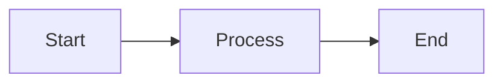

# 📊 Presentations

A repository for creating technical presentations using **Marp** (Markdown Presentation Ecosystem) with **Mermaid** diagram support.

## 🚀 Features

- **Markdown-based presentations** - Write slides in Markdown with Marp syntax
- **Mermaid diagrams** - Embed flowcharts, sequence diagrams, timelines, and more
- **Automated pipeline** - GitHub Actions automatically converts `.md` files to HTML and PDF
- **Pre-rendered diagrams** - Mermaid diagrams are pre-rendered to SVG for consistent sizing

## 📁 Project Structure

```
Presentations/
├── .github/
│   ├── scripts/
│   │   ├── render-mermaid.js      # Pre-renders Mermaid diagrams to SVG
│   │   └── puppeteer-config.json  # Puppeteer config for CI environments
│   └── workflows/
│       └── convert-md.yml         # GitHub Actions workflow
├── 1_CloudFlare/                  # Cloudflare outage presentation
├── 2_CancellationToken/           # CancellationToken presentation
├── 3_CancellationToken/           # CancellationToken presentation (v2)
└── README.md
```

## 🛠️ Prerequisites

- **Node.js** (v20 or later)
- **npm** (comes with Node.js)

## 📦 Installation

Install the required CLI tools globally:

```bash
# Install Marp CLI for converting Markdown to HTML/PDF
npm install -g @marp-team/marp-cli

# Install Mermaid CLI for rendering diagrams
npm install -g @mermaid-js/mermaid-cli
```

## 🏃 Running Locally

### 1. Preview a presentation (live reload)

```bash
# Start Marp in watch mode with live preview
marp --watch --preview your-presentation.md
```

### 2. Render Mermaid diagrams and generate outputs

```bash
# Step 1: Pre-render Mermaid diagrams to SVG
node .github/scripts/render-mermaid.js "path/to/presentation.md" "path/to/presentation.rendered.md"

# Step 2: Generate HTML
marp "path/to/presentation.rendered.md" -o "path/to/presentation.html"

# Step 3: Generate PDF
marp --pdf --allow-local-files "path/to/presentation.rendered.md" -o "path/to/presentation.pdf"
```

### Example with the Cloudflare presentation:

```bash
# Render mermaid diagrams
node .github/scripts/render-mermaid.js "1_CloudFlare/cloudflare_outage_2025.md" "1_CloudFlare/cloudflare_outage_2025.rendered.md"

# Generate HTML
marp "1_CloudFlare/cloudflare_outage_2025.rendered.md" -o "1_CloudFlare/cloudflare_outage_2025.html"

# Generate PDF
marp --pdf --allow-local-files "1_CloudFlare/cloudflare_outage_2025.rendered.md" -o "1_CloudFlare/cloudflare_outage_2025.pdf"
```

## 📐 Mermaid Diagram Sizing

By default, all Mermaid diagrams are rendered at:
- **Width:** 800px
- **Height:** 300px

### Override size for a specific diagram

Add special comments inside your Mermaid block:

````markdown

````

## 🔄 GitHub Actions Pipeline

When you push changes to the `main` branch, the GitHub Actions workflow automatically:

1. Detects changed `.md` files
2. Pre-renders Mermaid diagrams to SVG images
3. Generates `.html` and `.pdf` versions
4. Commits the generated files back to the repository

### Generated files:
- `*.rendered.md` - Markdown with Mermaid blocks replaced by `` tags
- `*.html` - HTML presentation
- `*.pdf` - PDF presentation
- `assets/mermaid/*.svg` - Pre-rendered diagram images

## ✍️ Writing Presentations

### Basic Marp frontmatter

```markdown
---
marp: true
theme: default
paginate: true
---

# My Presentation Title

---

# Slide 2

Content here...
```

### Adding Mermaid diagrams

````markdown

````

### Slide separators

Use `---` to separate slides.

## 🎨 Customizing Themes

Add custom CSS in the frontmatter:

```markdown
---
marp: true
style: |
  section {
    background-color: #1a1a2e;
    color: #eaeaea;
  }
  h1 {
    color: #f77f00;
  }
---
```

## 📚 Resources

- [Marp Documentation](https://marp.app/)
- [Mermaid Documentation](https://mermaid.js.org/)
- [Marp CLI](https://github.com/marp-team/marp-cli)
- [Mermaid CLI](https://github.com/mermaid-js/mermaid-cli)

## 📝 License

This project is for personal/educational use.
